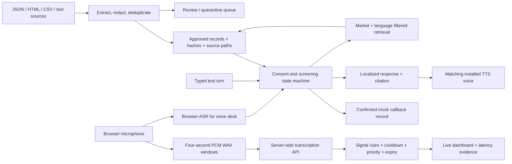
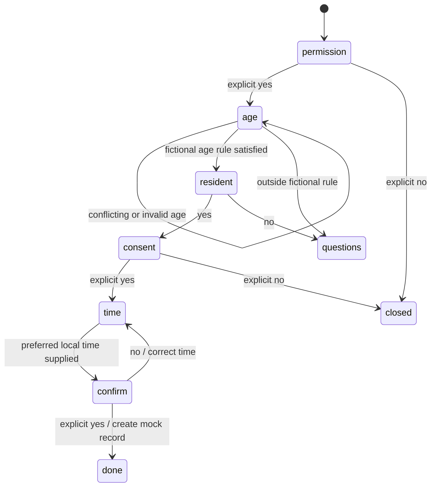

# Architecture and conversation flow

## Runtime

One Python standard-library HTTP service binds to loopback. Static HTML/CSS/JS renders the three workspaces. Browser requests carry an ephemeral local token and are subject to Host and Origin checks. Sessions have independent agents, nudge histories, locks, and chunk IDs. The service has a 100-session bound and removes old sessions when creating new ones. It is a local prototype, not an internet-facing application server.

`/api/session` creates a call or coach session. `/api/turn` performs one state transition and KB lookup. `/api/search` returns inspectable records. `/api/audio` transcribes a validated PCM16 WAV window, then immediately checks signals. `/api/analyze` accepts explicit text-test input. `/api/export` returns a call's redacted transcript and mock action.

## Philippine qualification

At any active stage, an FAQ retrieves a reviewed record and preserves the stage. Human-assistance requests route to consent for a **mock** callback; no real adviser is connected. A stop request closes screening. Unknown questions receive a localized fallback. A completed mock action is idempotent within the session.

The PH age range is a fictional fixture in `data/rules.json`, not an actual insurer's underwriting rule. The ID flow omits numerical qualification and routes to officer review. Neither approves an insurance policy or a loan. Callback time is stored as customer-confirmed text, not parsed into a real calendar booking.

## Trust boundaries

Source text is data. Unapproved website/text extraction does not enter the answer corpus automatically. The system does not execute instructions inside a document. There is no generated answer layer to follow a prompt injection, but corrupt approved records would still be harmful; approval is a real boundary.

Raw user audio is sent only in the configured live mode, after the UI's consent checkbox. Server transcripts are redacted by simple patterns. Audio itself is not redacted. Use only fictional content for shared evidence. Browser ASR may use the browser vendor's service; this is shown near the microphone control.
