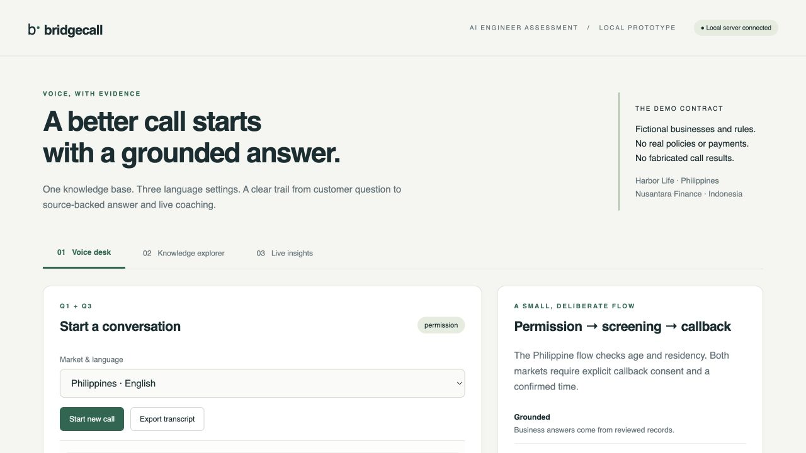
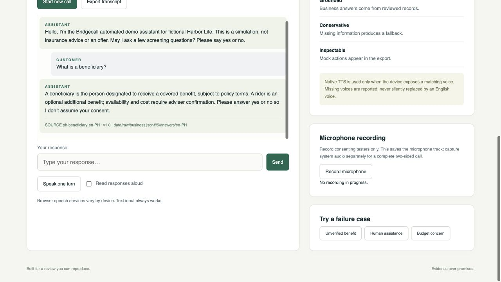
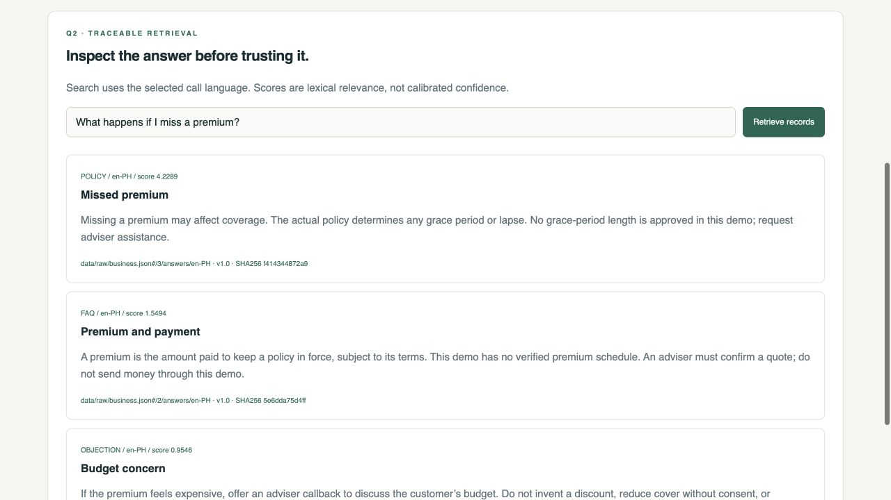
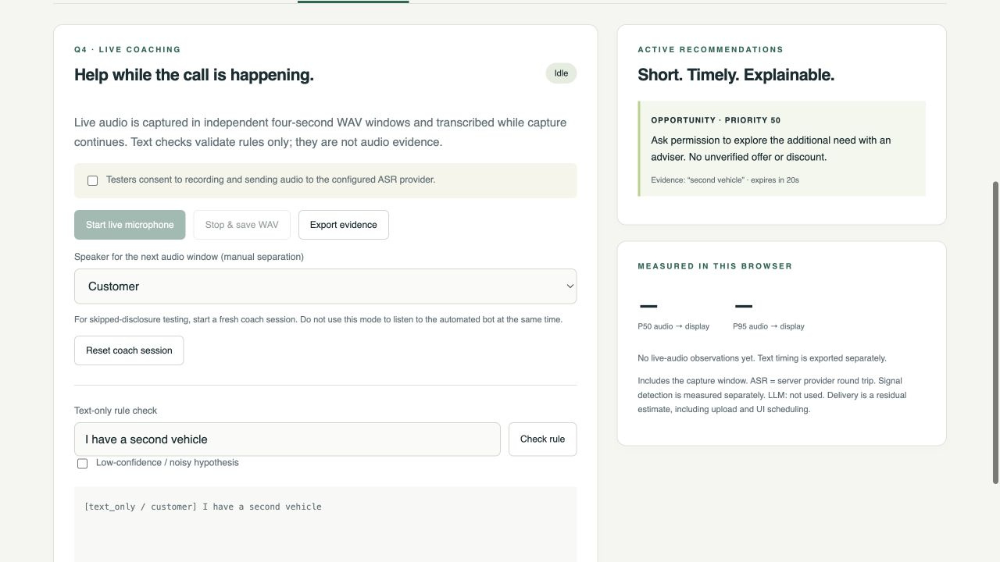
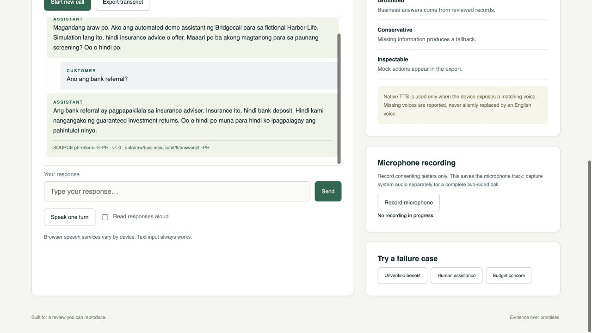
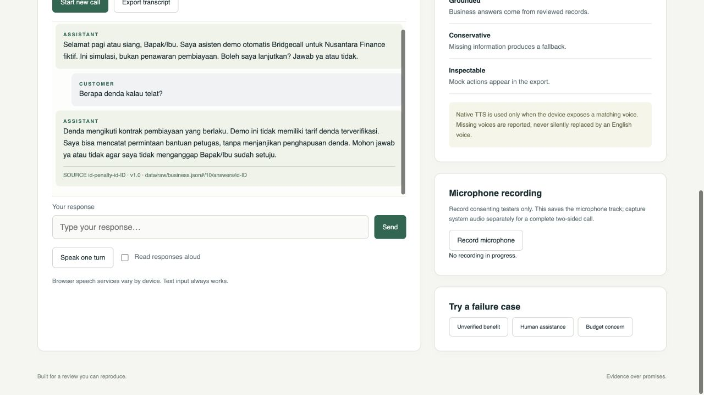
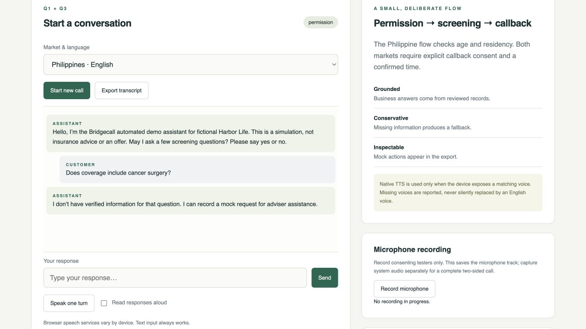

# Application screenshots

Captured on 23 September 2026 from the running local application. All input is typed, synthetic test content. These are UI evidence, not recorded calls, ASR results, native-speaker validation, or live-audio latency evidence.

## Application overview

Local server connected; three workspaces are available.

## Grounded answer

A beneficiary question returns the approved answer and exact source citation.

## Traceable retrieval

A missed-premium question ranks the policy record first, with source, version, and content hash.

## Coaching rule — text-only test

A second-vehicle phrase triggers an opportunity nudge. Audio timing remains unmeasured.

## Filipino / Taglish dialogue

The bank-referral answer and consent reminder remain in the selected locale.

## Indonesian dialogue

A denda question returns the Indonesian policy record without inventing a fee.

## Unsupported-question fallback

An unsupported medical-coverage question receives an explicit unavailable-information response.

